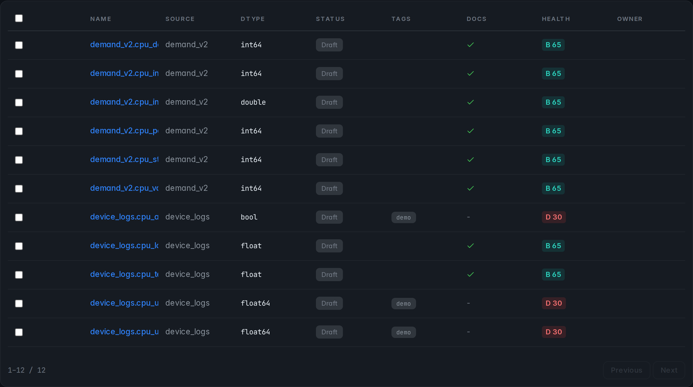
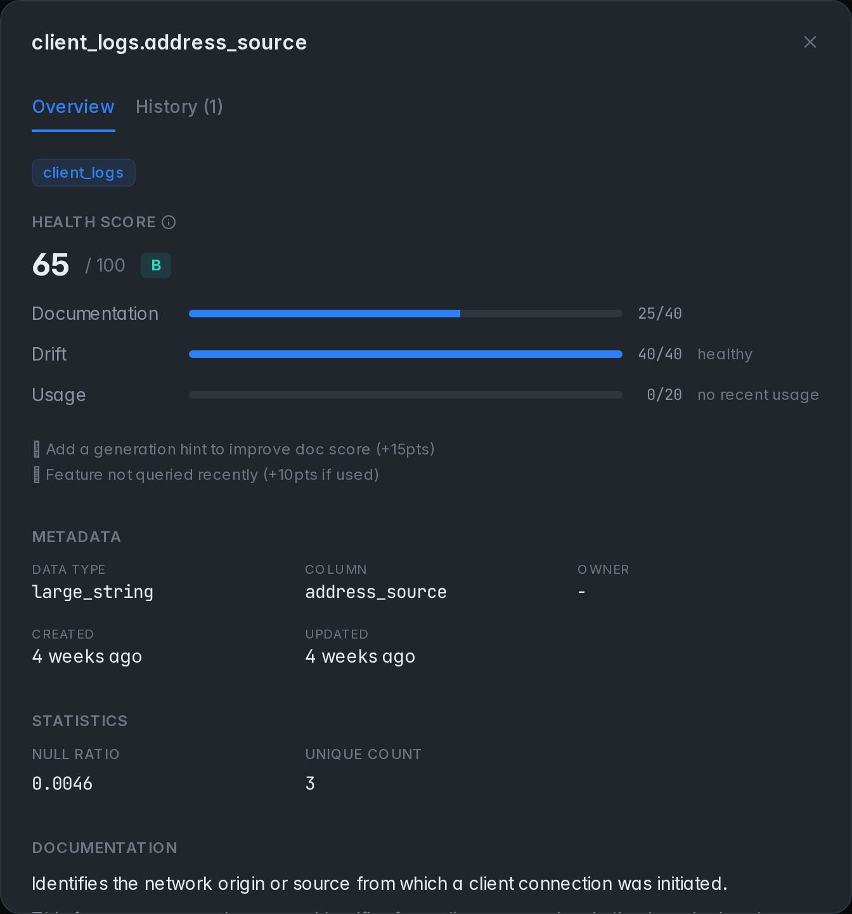
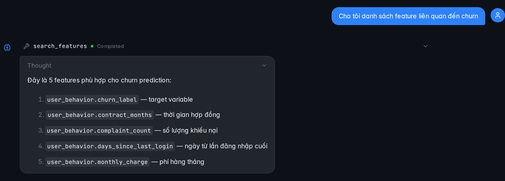
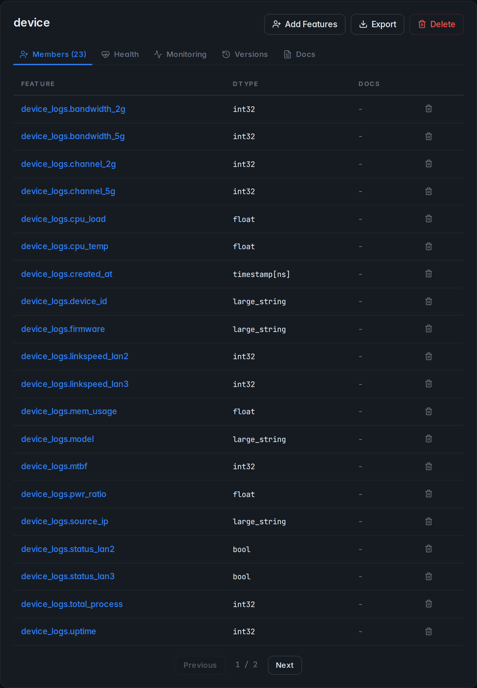
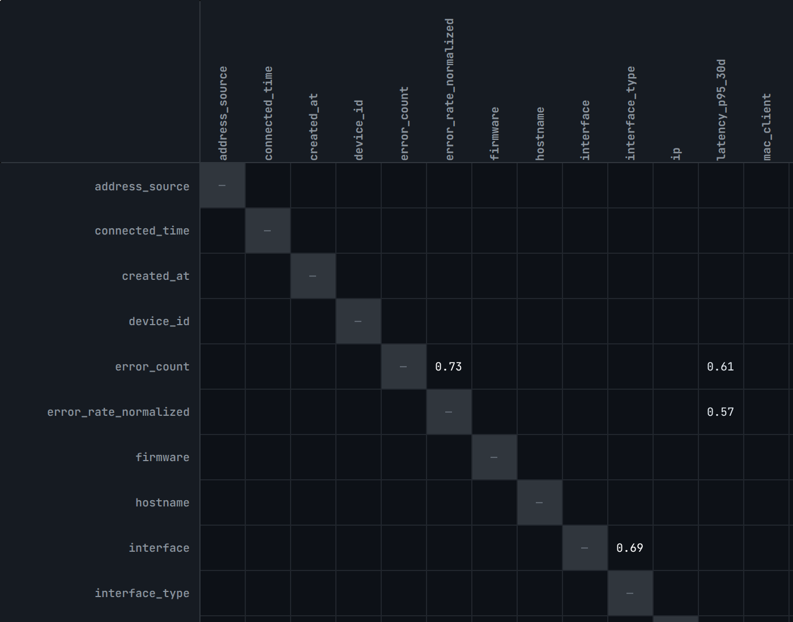
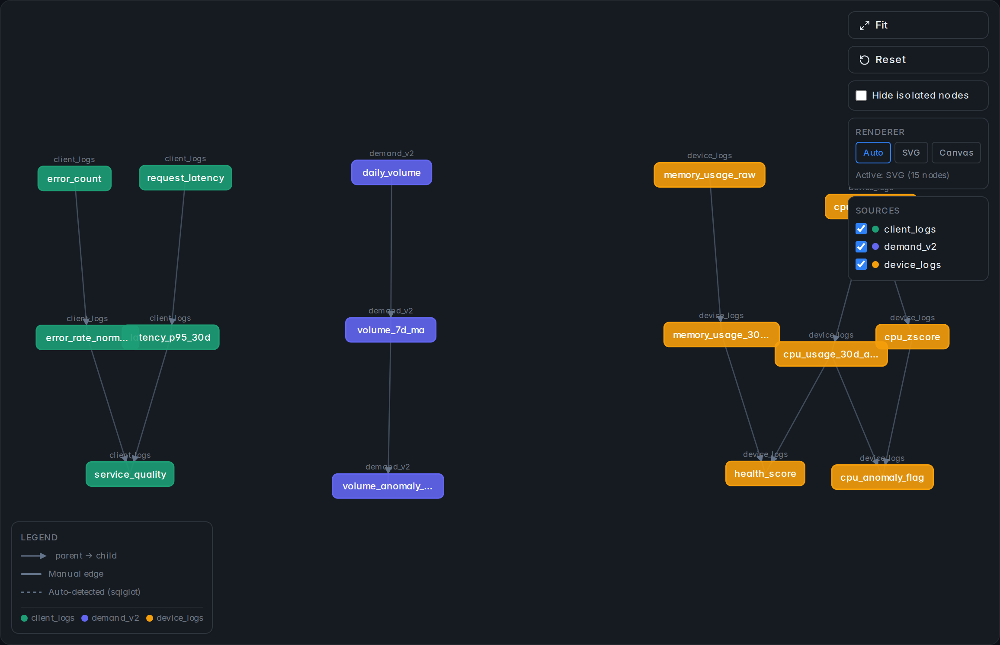
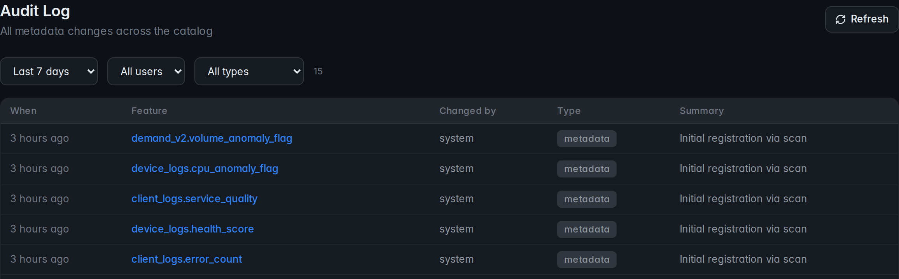

# featcat


**AI-powered Feature Store with CLI, TUI, REST API, and Web UI**

[Tiếng Việt](docs/README-vi.md)

<p align="center">
  
</p>

featcat is a lightweight Feature Store for data teams. It combines a searchable feature registry, offline source scanning, training dataset building, materialization audit history, and online feature serving, with an AI layer for searching, documenting, monitoring, and tracing lineage across features in Parquet files, S3, MinIO, PostgreSQL, and Redis-backed online stores.

## The Problem

- **Features scattered everywhere**: Parquet across local disks, S3, and MinIO — nobody knows what exists
- **Missing documentation**: Columns have no descriptions; new team members don't know what `avg_session_duration` means
- **Hard to find the right features**: Starting a new project with no idea which features are already available
- **No lineage**: Derived features lose track of where their inputs came from
- **Undetected drift**: Feature distributions change silently until model performance degrades

## Key Features

| Module | Description |
|--------|-------------|
| **Feature Store** | Register data sources, scan Parquet to auto-extract schema + stats; SQLite or PostgreSQL backend |
| **Agentic Chat** | Tool-calling AI agent with intent classifier, conversation memory across turns, and Vietnamese/English support |
| **Discovery** | Describe a use case → AI recommends relevant features and suggests new ones |
| **Auto-doc** | LLM-generated documentation for each feature, with batch generation jobs |
| **FTS5 Search** | SQLite full-text search with BM25 ranking and Vietnamese diacritic folding |
| **Lineage** | Track parent/child relationships between features; auto-detect from SQL definitions |
| **Similarity** | TF-IDF + embedding-backed feature similarity matrix and graph; duplicate detection |
| **Monitoring** | PSI / KL-divergence / Wasserstein drift metrics, null spikes, range violations, scheduled checks |
| **Materialization** | Build online feature values from feature views, record audits, and read latest serving values |
| **Web UI** | React SPA with a sticky top-bar global search (autocomplete + keyboard nav on every route): dashboard, feature browser, chat, lineage graph, similarity matrix, audit log |
| **TUI** | Terminal UI with dashboard, feature browser, AI chat |
| **REST API** | FastAPI server; every CLI/TUI/Web operation goes through the same endpoints |
| **S3 / MinIO** | Read Parquet directly from S3 — metadata only, never copies data locally |
| **Scheduler** | APScheduler-driven jobs for refresh, monitoring, doc generation |

## Four Interfaces, One Backend

| Interface | Use case |
|---|---|
| `featcat <cmd>` | Scripted ops, CI, terminal users |
| `featcat ui` | Full-screen TUI for quick browsing |
| `featcat serve` | FastAPI server at `:8000`, JSON REST + SSE chat |
| Web UI | React SPA bundled into the server, accessible at `:8000` once `serve` is running |

All four call into the same `CatalogBackend` abstraction (`featcat/catalog/backend.py`), so local-vs-remote (`FEATCAT_SERVER_URL`) is a one-env-var switch.

## Screenshots

<table>
  <tr>
    <td width="50%">
      <br>
      <sub><b>Features browser</b> — filter by source, tags, doc status; FTS5 search with Vietnamese diacritic folding</sub>
    </td>
    <td width="50%">
      <br>
      <sub><b>Feature detail</b> — schema, stats, AI-generated docs, lineage, recent usage</sub>
    </td>
  </tr>
  <tr>
    <td width="50%">
      <br>
      <sub><b>Agentic chat</b> — native tool-calling AI with conversation memory and bilingual (EN/VI) responses</sub>
    </td>
    <td width="50%">
      <br>
      <sub><b>Feature groups</b> — bundle related features for projects and downstream use cases</sub>
    </td>
  </tr>
  <tr>
    <td width="50%">
      <br>
      <sub><b>Similarity matrix</b> — TF-IDF + embedding-backed; spot duplicates at a glance</sub>
    </td>
    <td width="50%">
      <br>
      <sub><b>Lineage graph</b> — trace derivation chains parsed from SQL definitions</sub>
    </td>
  </tr>
  <tr>
    <td colspan="2" align="center">
      <br>
      <sub><b>Audit log</b> — actionable issues across the catalog (missing docs, drift, broken lineage)</sub>
    </td>
  </tr>
</table>

## Quick Start

```bash
# 1. Clone and install (no venv activation needed — uv handles it)
git clone https://github.com/codepawl/featcat.git && cd featcat
make install

# 2. Initialize catalog
uv run featcat init

# 3. Register and scan a data source
uv run featcat source add device_perf /data/features/device_performance.parquet
uv run featcat source scan device_perf

# 4. Browse features (CLI)
uv run featcat feature list
uv run featcat feature info device_perf.cpu_usage

# 5. (Optional) Enable AI — requires llama.cpp running at :8080
#    The repo ships a docker-compose for a Gemma GGUF backend; see deploy/.
docker compose -f deploy/docker-compose.yml up -d llama

uv run featcat discover "customer churn prediction"
uv run featcat ask "features related to user engagement"

# 6. Start the server (REST API + Web UI at http://localhost:8000)
uv run featcat serve
```

The bundled `./dev.sh` script does the full local stack (LLM container + backend + Vite dev server) in one go.

## TUI

```bash
featcat ui
```

Keybindings: `D` Dashboard · `F` Features · `M` Monitor · `C` Chat · `Q` Quit · `?` Help

## System Health Check

```bash
featcat doctor
```

```
[x] Python 3.10+
[x] SQLite catalog exists (catalog.db)
[x] llama.cpp running at localhost:8080
[x] Model gemma-4-E2B-it-Q4_K_M loaded
[x] 14 features registered
[x] 10 features have docs (71.4%)
[ ] 2 features have drift warnings
```

## Tech Stack

- **Backend**: Python 3.10+ · FastAPI · SQLAlchemy (SQLite default, PostgreSQL supported) · APScheduler · Pydantic
- **AI**: llama.cpp via OpenAI-compatible HTTP · native tool calling · response caching · FTS5 search
- **Web**: React 19 · TypeScript · Vite · Tailwind CSS · TanStack tooling
- **Data**: PyArrow · s3fs (S3/MinIO) · pgvector (optional, for embedding-backed similarity)
- **CLI/TUI**: Typer · Rich · Textual

## Project Structure

```
featcat/
├── catalog/        # Models, backends (Local/Remote), scanner, similarity, search
├── ai/             # Agentic chat, tool executor, intent classifier, session memory
├── llm/            # LLM abstraction (llama.cpp + cached wrapper)
├── plugins/        # Discovery, Autodoc, Monitoring, NL Query
├── server/         # FastAPI app, routes, scheduler, static assets
├── lineage/        # SQL-based lineage detection
├── db/             # SQLAlchemy engine + ORM models (SQLite + PostgreSQL)
├── tasks/          # Celery jobs (optional async batch work)
├── tui/            # Textual TUI (screens, widgets)
├── utils/          # Prompts, language detection, statistics, cache
├── config.py       # Pydantic settings (env > project > user > defaults)
└── cli.py          # Typer CLI entry point

web/                # React SPA — Vite build outputs to featcat/server/static/
deploy/             # Docker compose for llama.cpp + featcat
audits/             # Internal design + verification docs
```

## Testing

- Backend: `make test` (pytest, 730+ tests covering catalog, server, AI agent, plugins, lineage, S3 storage)
- Type-check: `make type-check` (mypy, all 100+ source files)
- Lint: `make lint` (ruff)
- Web UI E2E: `cd web && bun run test:e2e` — Playwright suite across 12 user journeys against an isolated backend with all AI endpoints mocked. See [web/tests/e2e/README.md](web/tests/e2e/README.md).
- Pre-commit gate: `make check` runs lint + type-check + test in sequence.

## License

MIT
