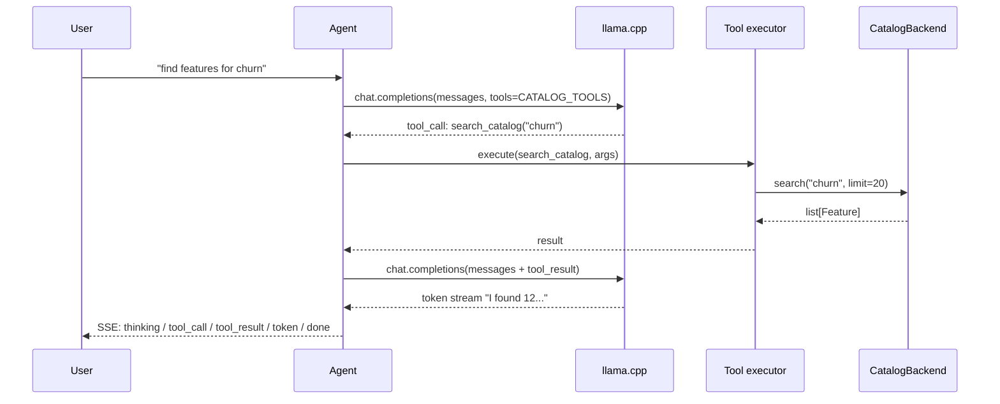

# AI layer

The AI layer has three loosely coupled parts: an LLM abstraction (`BaseLLM`), an embedding pipeline (`featcat/ai/embeddings.py`), and a tool-calling agent (`CatalogAgent`). All three sit behind one config switch — disable the LLM and the rest of featcat keeps working with degraded features.

## LLM abstraction

`featcat/llm/base.py` defines `BaseLLM`:

```python
class BaseLLM(ABC):
    def generate(self, prompt: str, **kwargs) -> str: ...
    def stream(self, prompt: str, **kwargs) -> Iterator[str]: ...
    def generate_json(self, prompt: str, schema: type[T] | None = None) -> T | dict: ...
    def health_check(self) -> dict: ...
```

Only one implementation today: `LlamaCppLLM` (`featcat/llm/llamacpp.py`), wrapping a [llama.cpp](https://github.com/ggerganov/llama.cpp) HTTP server (`/v1/completions`, `/v1/chat/completions`). The default model is Gemma 4 E2B IT-Q4_K_M.

`CachedLLM` wraps any `BaseLLM` with an SQLite response cache keyed on prompt hash. Used in production so doc generation re-runs are free. Bust with `force=True` to add a salt.

## Thinking-tag handling

The default model emits `<think>...</think>` blocks before the final answer. `strip_thinking_tags()` removes them so non-streaming callers (autodoc, plugins) get clean output. Streaming callers (chat) detect the boundary in-flight and emit separate SSE events: `thinking_start` / `thinking` / `thinking_end` then regular `token` events.

```
Model output:  "<think>The user asked about session counts. Let me look up the feature.</think>The session_count_30d feature counts..."
Non-stream  :  "The session_count_30d feature counts..."
Stream      :  thinking_start → thinking('The user...') → thinking_end → token('The') → token(' session_count_30d') → ...
```

## JSON mode

`generate_json()` calls llama.cpp with `json_mode=true` and retries once with a stricter prompt on parse failure. `_extract_json()` accepts:

- Bare JSON objects: `{...}`
- Bare JSON arrays: `[...]`
- Fenced code blocks: ` ```json\n{...}\n``` `
- JSON embedded in prose

Used by autodoc and the discovery plugin. Pydantic validation runs on the parsed result if a schema is passed.

## Embedding pipeline

When `[embeddings]` extra is installed (`uv pip install -e ".[embeddings]"`), `featcat/ai/embeddings.py` initializes a `sentence-transformers` model — `all-MiniLM-L6-v2` by default, 384-dim. Single CPU thread, ~5ms/feature.

Pipeline:

1. **Source text**: `name + ' | ' + (long_description or short_description or '')` — concatenation lets the embedding capture both identifier and meaning.
2. **Encode**: `model.encode(texts, batch_size=64, normalize_embeddings=True)` — L2-normalized so cosine = dot product.
3. **Persist**: write to `features.embedding` via the `Embedding` TypeDecorator. PostgreSQL stores native `vector(384)`; SQLite stores JSON text.
4. **Trigger**: re-embed when `(name, description)` changes. The autodoc plugin invalidates after writing a doc.

Querying:

```sql
-- PostgreSQL
SELECT name FROM features
ORDER BY embedding <=> :query_embedding
LIMIT 20;

-- SQLite (TF-IDF fallback in Python)
sklearn.feature_extraction.text.TfidfVectorizer + cosine_similarity
```

## Agent loop

`CatalogAgent` in `featcat/ai/agent.py` is the chat brain:



- **Max 2 tool rounds** per query (`FEATCAT_LLM_MAX_TOOL_ROUNDS`). Prevents loops, keeps latency bounded.
- **Duplicate tool calls** detected by `(name, args)` hash and short-circuited.
- **Streaming** uses llama.cpp's native SSE; the agent re-emits as featcat-flavored events.

## Tool spec

`featcat/ai/tools.py` defines five tools as JSON-schema dicts (the format llama.cpp expects):

| Tool | Inputs | Output |
|---|---|---|
| `search_catalog` | query, limit | list[FeatureSummary] |
| `get_feature_detail` | name | Feature + doc + stats |
| `compare_features` | names: list[str] | Side-by-side diff |
| `find_similar_features` | name, top_k | list[FeatureSummary] with scores |
| `get_drift_report` | source / since | Aggregated drift counts |

`featcat/ai/executor.py` dispatches tool names to backend methods. New tools: add to `CATALOG_TOOLS` + add an executor branch + make sure the underlying backend method exists on `CatalogBackend`.

## Plugins

`featcat/plugins/` extends the LLM-driven feature surface beyond chat:

| Plugin | Entry point | What it does |
|---|---|---|
| `DiscoveryPlugin` | `featcat discover --query "..."` | Embedding+keyword search, returns ranked features |
| `AutodocPlugin` | `featcat docs generate ...` | Generates short/long descriptions per feature |
| `MonitoringPlugin` | `featcat monitor check` | Runs PSI + asks the LLM for a one-line summary on critical drift |
| `NLQueryPlugin` | `featcat query "..."` | Translates natural language to a feature spec |

Contract: `BasePlugin.execute(catalog_db: CatalogBackend, llm: BaseLLM, **kwargs) -> PluginResult`. `PluginResult` has `status`, `data`, `errors`. Plugins are called identically from CLI / API / scheduler.

## Bilingual support

`featcat/utils/lang.py` detects the user's input language (Vietnamese vs English by character set + common-word heuristic). `localize_system_prompt()` injects a "respond in <lang>" instruction. Feature names and JSON schema keys always stay English. System prompts always English so the model behaves consistently.

## Disabling the AI layer

For environments without LLM access:

```bash
FEATCAT_LLM_ENABLED=false featcat serve
```

The catalog browser, monitoring (without LLM summaries), groups, and the SDK still work. Only the chat page, autodoc, NL query, and similarity-via-embeddings degrade.

## Related

- **[Architecture Overview](overview.md)** — where AI fits in the layer cake
- **[Architecture › Data Layer](data.md)** — `embedding` column, indexes
- **[User Guide › AI assistant](../user-guide/ai.md)** — end-user view
- **[User Guide › Documentation](../user-guide/docs.md)** — autodoc behavior
