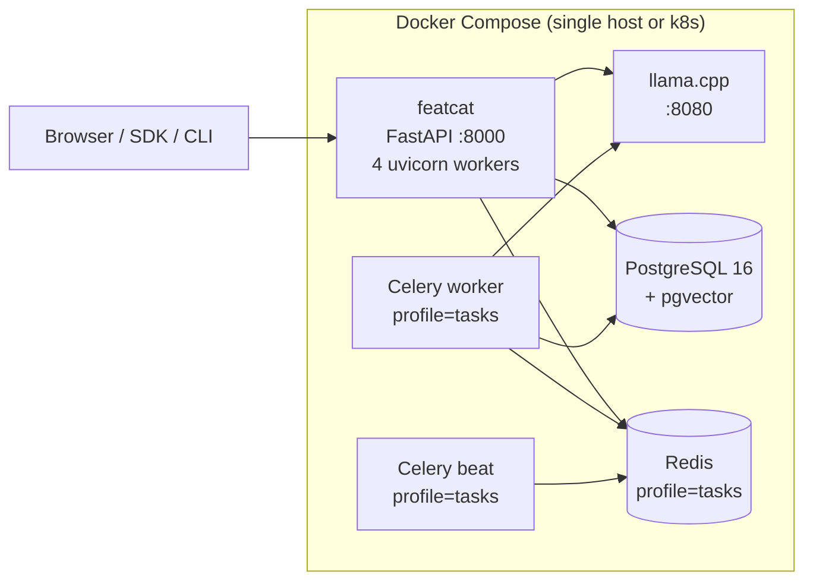

# Deployment architecture

The default deployment is a Docker Compose stack: one container per concern, all on the same network. Production-grade in itself for ≤ 50-engineer teams; scales out per-service when needed.

## Services

### `featcat` (the API + web UI)

- Image: built from `deploy/Dockerfile` (multi-stage: node builds React, python serves it)
- Process: `uvicorn featcat.server:create_app --workers 4`
- Port: `:8000`
- Static files: built React app under `featcat/server/static/`, served by FastAPI
- Editable install (`uv pip install -e .`) so `Path(__file__)` resolves to `/app/featcat/server/`

### `llm` (llama.cpp inference)

- Image: `ghcr.io/ggerganov/llama.cpp:server`
- Volume: `./deploy/models/` mounted to `/models` (the GGUF lives here)
- Port: `:8080`
- ENV: `LLAMA_ARG_MODEL=/models/gemma-4-E2B-it-Q4_K_M.gguf`
- Resource: ~5GB RAM at idle, 8GB peak. CPU-only by default; flip `LLAMA_ARG_NGL` for GPU.

### `postgres` (production target)

- Image: `pgvector/pgvector:pg16`
- Volume: `pgdata:/var/lib/postgresql/data`
- Port: `:5432` (internal only by default)
- Init: `featcat init --backend postgres` runs alembic migrations

### `redis` + `celery-worker` + `celery-beat` (optional, profile `tasks`)

Off by default. Activated with `docker compose --profile tasks up -d`.

- `redis`: `:6379` internal. Broker for Celery + light caching.
- `celery-worker`: 2 workers per default container. Concurrency tuned for embedding + autodoc workloads.
- `celery-beat`: cron daemon. Replaces APScheduler when active.

The toggle: `FEATCAT_TASKS_BACKEND` = `apscheduler` (default, in-process) or `celery` (out-of-process).

## Network topology

All containers on a single Docker bridge network. Only `featcat:8000` is published to the host. PostgreSQL, Redis, and llama.cpp reach each other by service name (`postgres`, `redis`, `llm`).

For TLS, terminate at a reverse proxy upstream (Caddy / nginx / Traefik). featcat itself doesn't speak HTTPS — `--proxy-headers` is on so client IPs are preserved.

## Scaling

featcat scales by service:

| Service | How to scale | Bottleneck |
|---|---|---|
| `featcat` | Add uvicorn workers (env `WEB_CONCURRENCY=8`) or replicate the container behind a load balancer | I/O-bound. CPU rarely a problem. |
| `llm` | Replicate the container; round-robin LB. Or move to a GPU host. | Wall-clock latency. ~5–10s/feature on CPU. |
| `postgres` | Vertical first (RAM, SSD). Read replicas for the SDK if needed. | Index-heavy queries (search, similarity). |
| `celery-worker` | Increase replicas; tune `--concurrency`. | Worker count for parallel docgen / embed. |

Single-host limits: ~10k features per source, ~50 concurrent users, ~1M monitoring checks/day on a 4-vCPU 16GB host.

## State

- **`pgdata`** — PostgreSQL data dir. The only durable state.
- **`./deploy/models/`** — GGUF model files. Re-downloadable from HuggingFace via `dev.sh`.
- **`./data/sources/`** — your Parquet/SQL source files. Owned by you, mounted read-only into the API container at `/sources`.

Rebuild any container without data loss as long as you preserve `pgdata`.

## Secrets

- `POSTGRES_PASSWORD` — set via env, not committed.
- No LLM auth (local container).
- No SMTP / Slack / etc. today.

Use a `.env` file at the compose root (gitignored). For k8s: pass via Secret object.

## Observability hooks

- **Logs**: `docker compose logs -f featcat`.
- **Health**: `GET /api/health` returns `{db, llm, scheduler}` status. Uptime: 2xx vs 503.
- **Metrics**: Prometheus exporter is on the roadmap; today, scrape `/api/health/stats/*` for catalog counts.

## Migration: SQLite → PostgreSQL

Single-direction. Not automated.

1. Stand up the postgres service.
2. `featcat init --backend postgres` to run alembic migrations on the empty postgres DB.
3. Use a one-off script (`scripts/sqlite_to_postgres.py`, see [Ops › Backup](../ops/backup.md)) to copy rows table-by-table. Order matters: `data_sources → features → feature_docs → ...`.
4. Switch `FEATCAT_DB_URL` to postgres and restart.
5. Verify with `featcat feature list` and the web UI dashboard.

After cutover, the SQLite file becomes a backup. Keep it for at least a week before deleting.

## Production checklist

- [ ] PostgreSQL `pgvector` extension installed (image `pgvector/pgvector:pg16` does this)
- [ ] Daily `pg_dump` to off-host storage ([Backup](../ops/backup.md))
- [ ] Alembic head matches code (`alembic current` == `alembic heads`)
- [ ] `make check` green on the running tag
- [ ] Reverse proxy terminating TLS, forwarding `Host` + `X-Forwarded-For`
- [ ] Monitor scrape on `/api/health` ([Monitoring](../ops/monitoring.md))
- [ ] LLM container has model file mounted and is reachable (`curl llm:8080/v1/models`)

## Related

- **[Architecture Overview](overview.md)** — services in context
- **[Architecture › Data Layer](data.md)** — what's in PostgreSQL
- **[Ops › Deployment](../ops/deployment.md)** — step-by-step production deploy
- **[Ops › Monitoring](../ops/monitoring.md)** — what to scrape
