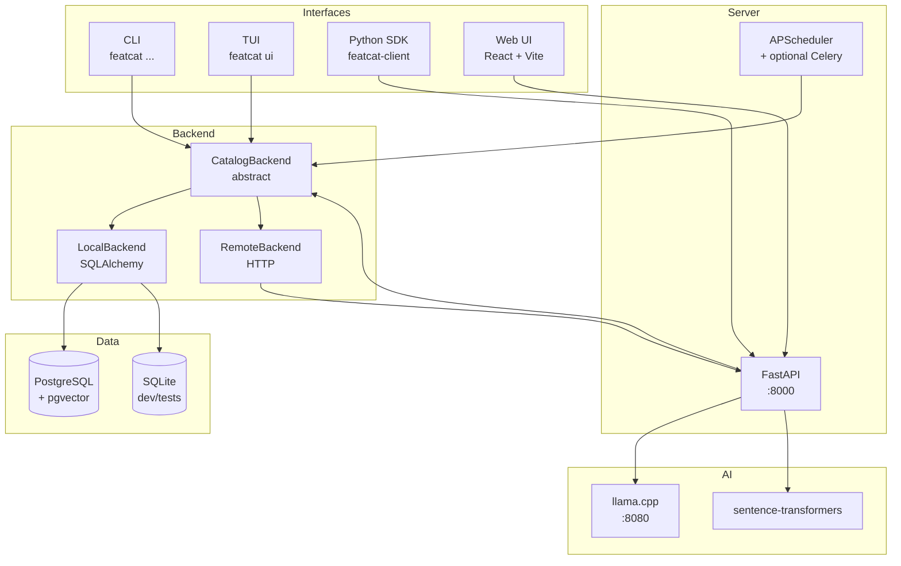
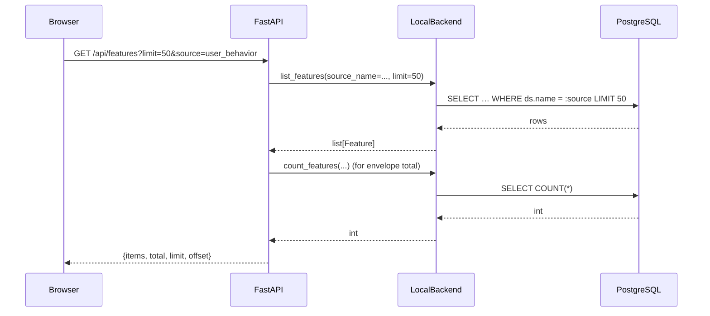

# Architecture overview

featcat has four interfaces (CLI, TUI, REST API, web UI) sitting on top of one shared backend abstraction. This page is the bird's-eye view; deeper dives live in [Data Layer](data.md) and [AI Layer](ai.md).

## Pieces

### Interfaces

- **CLI** (`featcat`) — built on Typer. Entry point in `featcat/cli.py`. Talks to a `CatalogBackend` directly via `_get_db()`, which returns either `LocalBackend` (default) or `RemoteBackend` (when `FEATCAT_SERVER_URL` is set).
- **TUI** (`featcat ui`) — Textual app under `featcat/tui/`. Same `CatalogBackend` plumbing as the CLI.
- **REST API** (`featcat serve`) — FastAPI app factory in `featcat/server/app.py`. ~15 routers under `/api/*`.
- **Python SDK** (`featcat-client`) — separate package under `packages/client/`. Sync `httpx` client + polars helpers. See [SDK Quickstart](../sdk/quickstart.md).
- **Web UI** — React 19 + Vite + Tailwind. Source under `web/`. Vite builds into `featcat/server/static/` so the FastAPI app can serve both.

### Backend abstraction

Every interface goes through `CatalogBackend`, defined in `featcat/catalog/backend.py`. Two implementations:

- **`LocalBackend`** — SQLAlchemy 2.x against PostgreSQL or SQLite. The same code paths run on either dialect; backend chosen via `FEATCAT_DB_BACKEND` env. Owns the *real* implementation of every method.
- **`RemoteBackend`** — `httpx` client that calls the REST API. Used by the CLI when pointed at a remote server (for shared team installs).

> **Convention**: the abstract class provides default no-op implementations for newer methods (`find_similar_features`, `get_impact`, `create_notification`, etc.) so downstream backends opt in instead of having to implement everything. Required core methods are `@abstractmethod`.

### Data layer

- **PostgreSQL 16** — production target. Schema managed by Alembic. `pgvector` extension powers similarity search. `tsvector` stored generated columns power ranked search.
- **SQLite** — dev + test target. Same SQLAlchemy models, fewer features (no pgvector, no tsvector). Roughly: anything that needs Postgres-only DDL has a sqlite fallback in the code (TF-IDF instead of pgvector, in-process token scan instead of tsvector).
- **Schema source of truth**: `featcat/db/models.py` (SQLAlchemy). Migrations in `featcat/db/migrations/versions/`.

→ [Architecture › Data Layer](data.md)

### AI layer

- **`llama.cpp`** — local LLM server (default model: Gemma 4 E2B IT-Q4_K_M GGUF). Reachable at `:8080` from the API container. Used for documentation generation, monitoring drift analysis, and the AI chat agent.
- **sentence-transformers** — CPU-friendly embedding model (`all-MiniLM-L6-v2`, 384-dim). Optional via the `[embeddings]` extra. Powers vector similarity + NL-query embed-first retrieval.
- **Plugins** — under `featcat/plugins/`. Each is a `BasePlugin` with an `execute(catalog_db, llm, **kwargs) → PluginResult`. Discoverable, reused by CLI / API / scheduler.

→ [Architecture › AI Layer](ai.md)

### Scheduler / job queue

Two paths coexist during the migration window:

- **APScheduler** (in-process) — current production. Lives in `featcat/server/scheduler.py`. Four default jobs: `monitor_check`, `doc_generate`, `source_scan`, `baseline_refresh`.
- **Celery + Redis** (opt-in) — distributed. `featcat/tasks/app.py` defines the Celery app + queues. All four default jobs (`monitor_check`, `doc_generate`, `source_scan`, `baseline_refresh`) have Celery tasks as of T1.5b. Toggle with `FEATCAT_TASKS_BACKEND=celery`; APScheduler still drives the cron triggers and ships work to Celery via `send_task()`. Activated via the `tasks` Docker Compose profile.

→ [Architecture › Deployment](deployment.md)

## Request lifecycle (web UI clicking around)

The paginated path pushes filters to SQL via the `Embedding`/`tsvector`/regular indexes the migration adds. The legacy unpaginated path (`?limit` absent) is kept for back-compat — see [User Guide › Catalog Browser](../user-guide/catalog.md).

## Where to look in the code

| Concern | File |
|---|---|
| CLI entrypoints | `featcat/cli.py` |
| FastAPI app factory | `featcat/server/app.py` |
| Routers | `featcat/server/routes/*.py` |
| Backend abstract | `featcat/catalog/backend.py` |
| Backend impl | `featcat/catalog/local.py` (1 large file by design — easier to grep than 12 small ones) |
| ORM models | `featcat/db/models.py` |
| Alembic migrations | `featcat/db/migrations/versions/` |
| Plugins | `featcat/plugins/{discovery,autodoc,monitoring,nl_query}.py` |
| AI agent | `featcat/ai/agent.py` |
| Embeddings | `featcat/ai/embeddings.py` |
| SDK | `packages/client/src/featcat_client/` |
| Web UI | `web/src/` |

## What's next

- **[Data Layer](data.md)** — schema, indexes, migration story (sqlite → postgres), pgvector + tsvector setup.
- **[AI Layer](ai.md)** — plugin contract, agent loop, embedding pipeline, prompt structure.
- **[Deployment](deployment.md)** — Docker Compose stack, environment variables, scaling considerations.
